# Documentation Milestone 1 Dimas Adhi Pratama

 

## **1. Deploy Github Project to Vercel** [Click Here](#deploy-github-project-to-vercel)

## **2. Langkah Membuat Domain di Hostinger** [Click Here](#langkah-membuat-domain-di-hostinger)

## **3. Connect custom domain and DNS** [Click Here](#connect-custom-domain-and-dns)

  

# **Deploy Github Project to Vercel**

### 1. Buka vercel.com, Klik **Add New** di bagian kanan & pilih Project

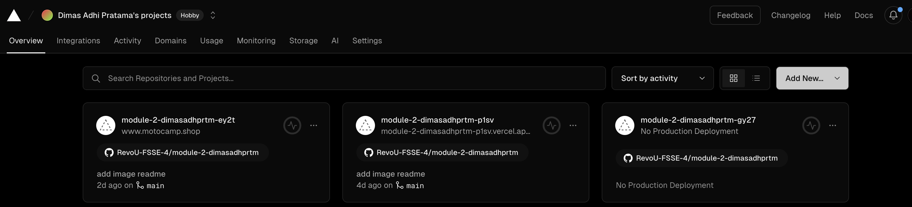

### 2. Dalam kolom search ketik nama project dan klik **import**

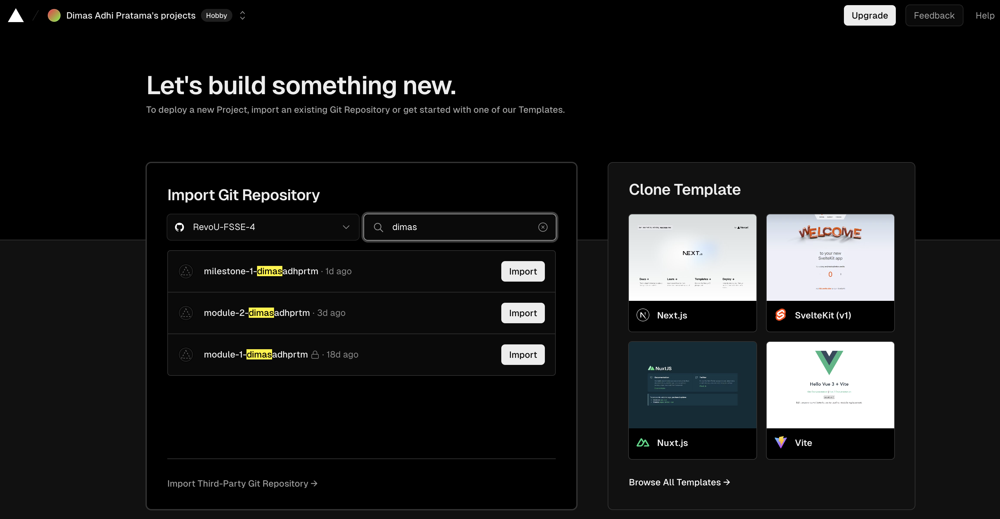

### 3. Klik Deploy di bagian bawah

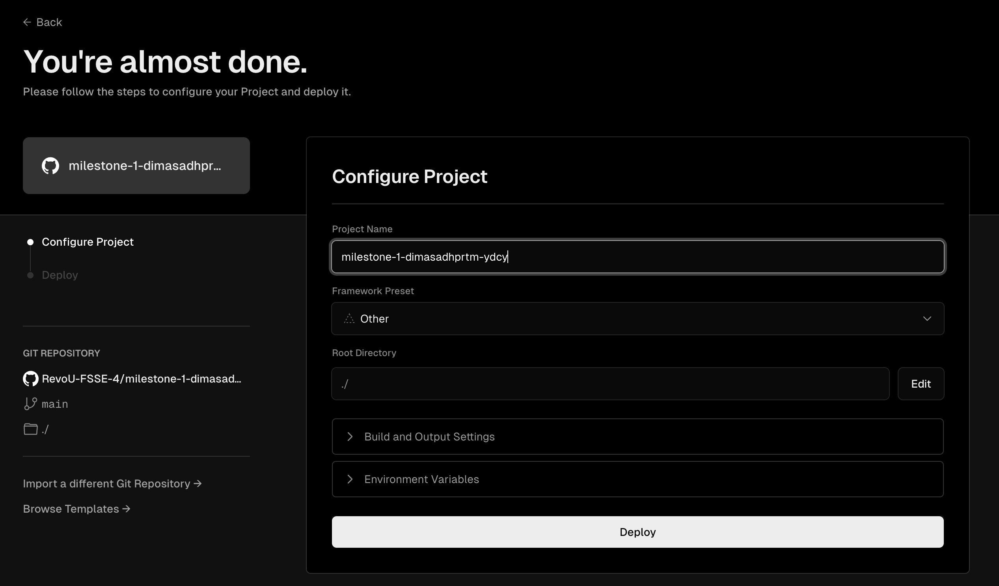

### 4. Jika sudah berhasil, klik **Continue to Dashboard**

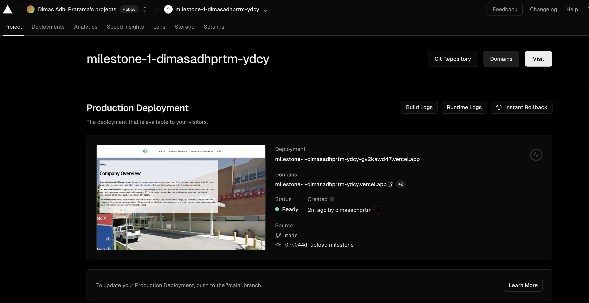

### 5. Setelah berhasil masuk ke dashboard, silahkan buka github untuk cek konektivitas Github to Vercel. Pada bagian kanan di bawah _About_ akan ada link yang menandakan bahwa Github sudah berhasil deploy ke vercel dan auto deploy jika ada perubahan pada coding

    

# **Langkah membuat Domain di Hostinger**

### 1. Buka website hostinger.co.id dan Klik **Log In**. Jika sudah berhasil Log In maka pilih Tab **Domains** dan pilih **Get a New Domain**

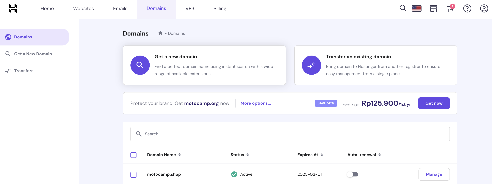

### 2. Jika sudah memasukkan nama domain yang diinginkan, maka dilanjutkan untuk memilih nama akhir domain, contoh pilih .shop dan klik search. Jika nama domain tersedia maka klik **Buy Now**

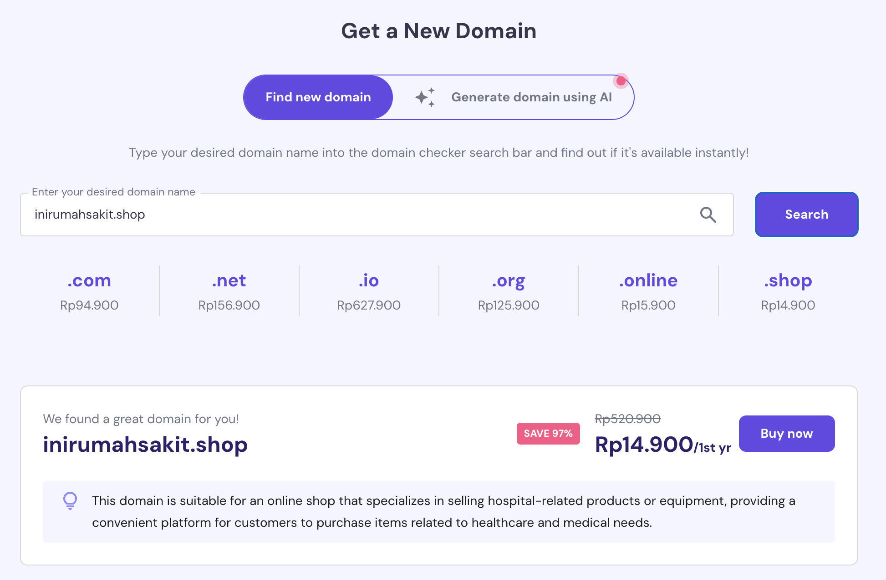

### 3. Dilanjutkan untuk pemilihan paket pembayaran. Klik **Choose Payment Method**

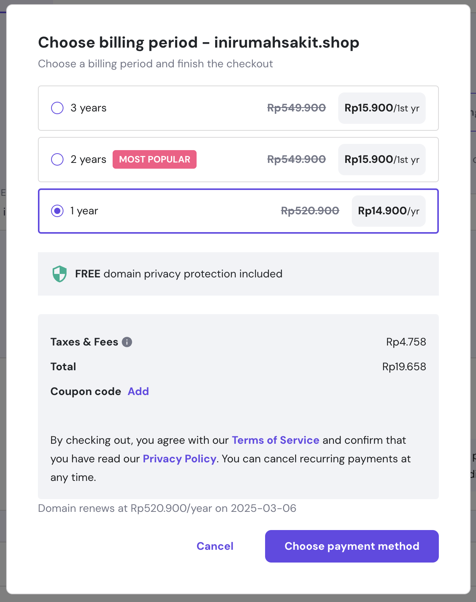

### 4. Pilih jenis pembayaran, sebagai contoh kita akan memilih pembayaran melalui QRIS.

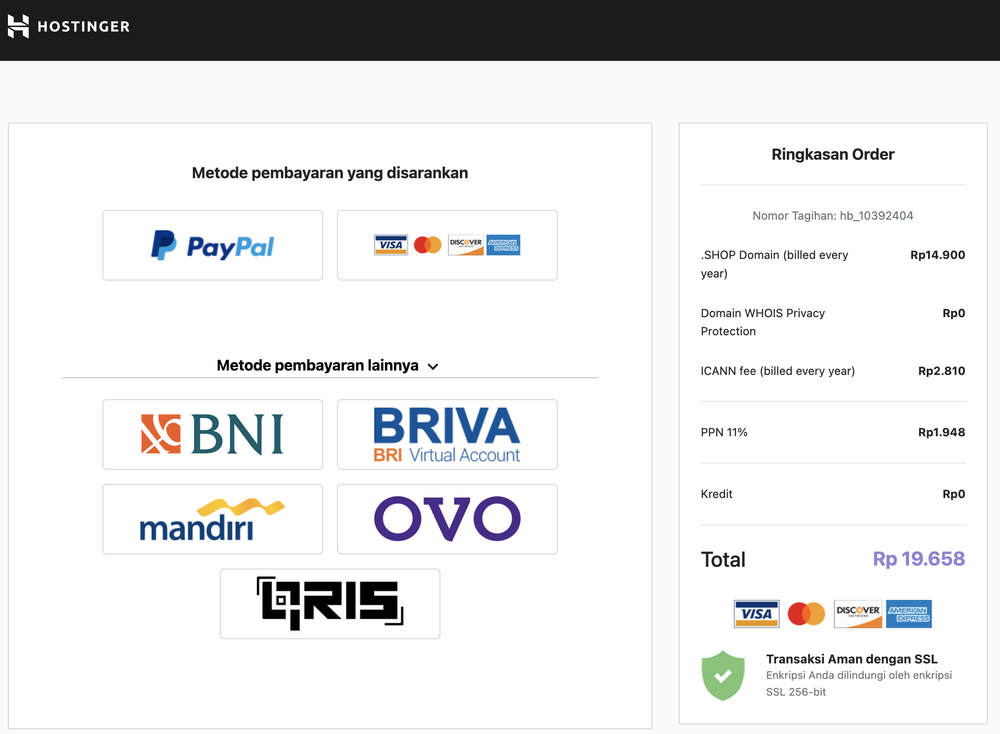

### 5. Jika sudah berhasil melakukan pembayaran maka klik continue dan selanjutnya hubungkan domain dengan DNS menggunakan cloudflare

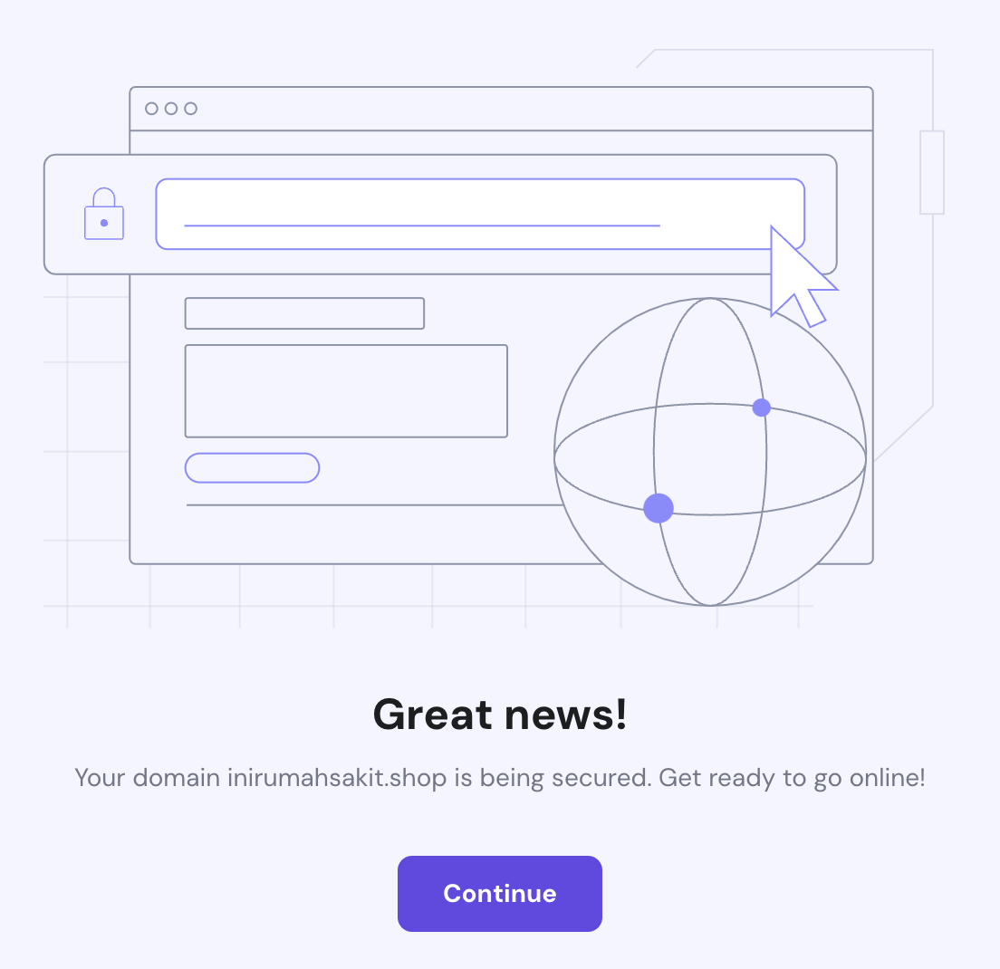

    

# **Connect custom domain and DNS**

### 1. Buka website **cloudflare.com** lalu pilih **sign up** atau **log in** dengan mengisi email dan password

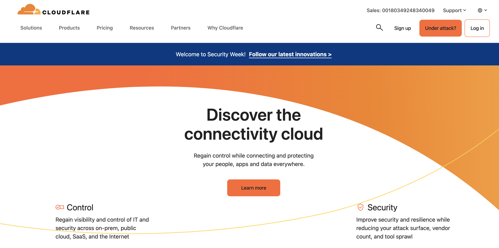

### 2. Jika sudah berhasil **sign up** maka pilih **Add Site** button

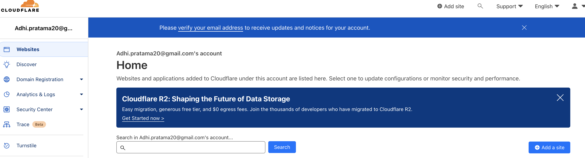

### 3. Isi nama domain yang sudah dibuat pada kolom yang tersedia dan klik **Continue**

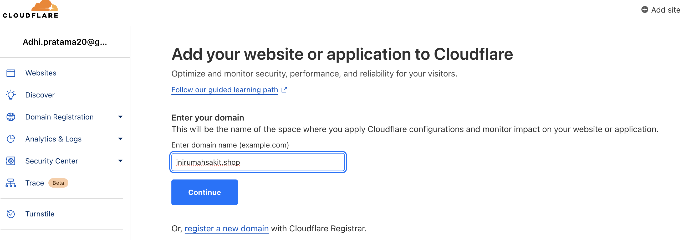

### 4. Akan tampil pilihan paket lalu scroll ke bawah dan pilih \*Free** lalu klik **Continue\*\*

### 5. Jika sudah tampil halaman berikut maka scroll ke bawah dan klik **Continue**

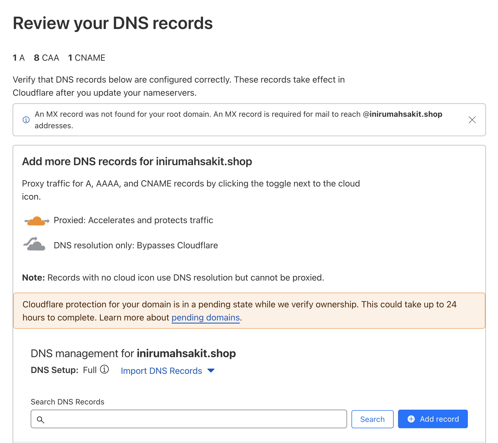

### 6. Selanjutnya copy 2 **Name server** ke website hostinger

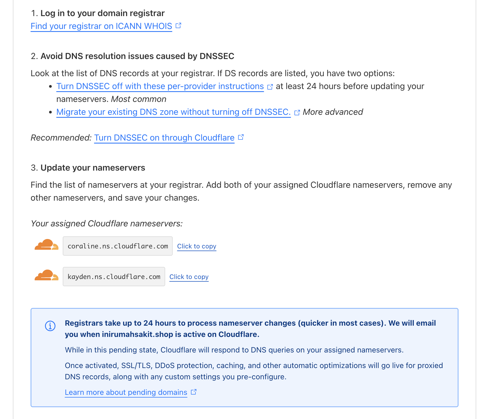

### 7. Buka kembali webiste Hostinger dan pilih **DNS/Nameservers** di sidebar kiri lalu klik **Change Nameservers**

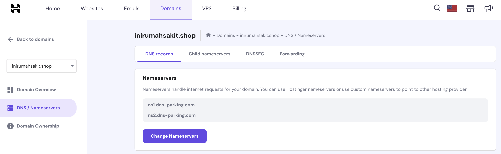

### 8. Pada menu **Select Nameservers** pilih **Change Nameservers**, lalu paste 2 **Nameservers** dari **Cloudflare** lalu klik **Save**

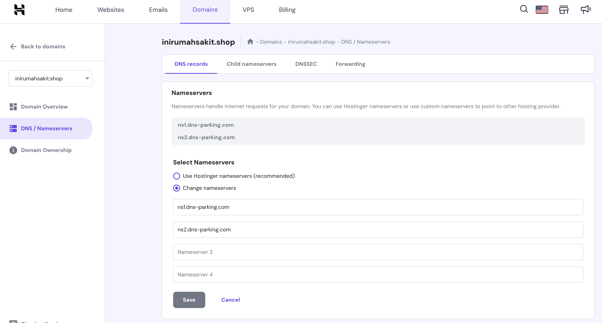

### 9. Akan muncul **Pop Up** seperti halaman berikut dan klik **Close**, tunggu kurang lebih 24 jam agar website sudah dapat dipublish

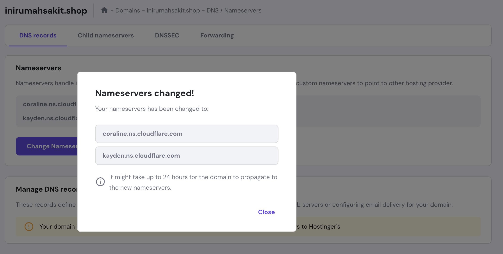
