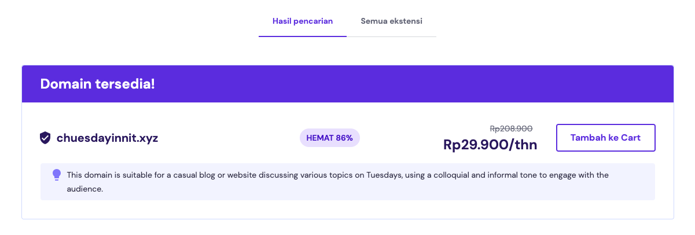
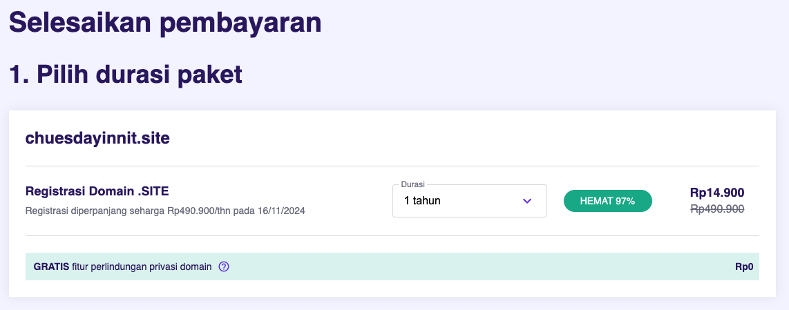
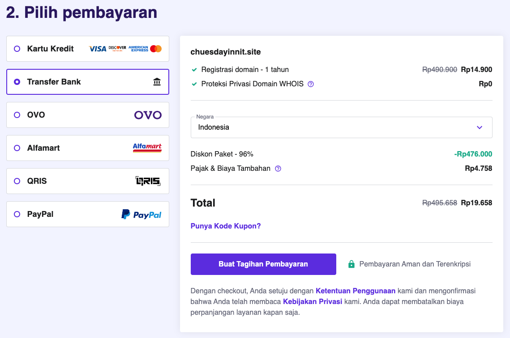

# Documentation Milestone 1 Dimas Adhi Pratama

 

## **1. Deploy Github Project to Vercel** [Click Here](#deploy-github-project-to-vercel)

## **2. Langkah Membuat Domain di Hostinger** [Click Here](#langkah-membuat-domain-di-hostinger)

## **3. Connect custom domain and DNS** [Click Here](#connect-custom-domain-and-dns)

  

# **Deploy Github Project to Vercel**

### 1. Buka vercel.com, Klik **Add New** di bagian kanan & pilih Project

### 2. Dalam kolom search ketik nama project dan klik **import**

### 3. Klik Deploy di bagian bawah

### 4. Jika sudah berhasil, klik **Continue to Dashboard**

### 5. Setelah berhasil masuk ke dashboard, silahkan buka github untuk cek konektivitas Github to Vercel

### 6. Pada bagian kanan di bawah _About_ akan ada link yang menandakan bahwa Github sudah berhasil deploy ke vercel dan auto deploy jika ada perubahan pada coding

    

# **Langkah membuat Domain di Hostinger**

### 1. Buka website hostinger.com, ketik nama domain yang diinginkan pada kolom **Cek Domain**, lalu pilih nama akhir untuk website kita

### 2. Jika sudah memasukkan nama domain yang diinginkan, maka dilanjutkan untuk memilih paket, klik **tambah ke cart**

### 3. Dilanjutkan untuk melakukan pembayaran

### 4. Pilih jenis pembayaran, sebagai contoh kita akan memilih pembayaran melalui QRIS

### 5. Cek kembali detailnya sebelum melakukan pembayaran, jika sudah sesuai maka klik **Lanjutkan dengan QRIS**

### 6. Lanjutkan dengan melakukan scan QR Code

### 7. Jika sudah melakukan pembayaran maka akan diarahkan untuk menyelesaikan registrasi domain, silahkan pilih preferensi **Personal** atau **Company** sesuai dengan kebutuhan. Lalu klik **Next Step**

### 8. Dilanjutkan mengisi detail kontak seperti :

- Nama lengkap
- email
- Alamat lengkap
- Nomer telepon
- Klik _**Continue**_
  

### 9. Klik **Skip** di bagian bawah jika tidak ingin menambahkan plan/fitur. Selamat Anda berhasil mendaftarkan nama domain. Selanjutnya hubungkan domain dengan DNS menggunakan cloudflare

    

# **Connect custom domain and DNS**

### 1. Buka website **cloudflare.com** lalu pilih **sign up** atau **log in** dengan mengisi email dan password

### 2. Jika sudah berhasil **sign up** maka dianjutkan tahap berikut :

- tulis nama domain custom yang sudah dibuat sebelumnya (pada website hostinger) pada kolom yang tersedia
- klik **Continue**
  

### 3. Pada tampilan berikut, pilih kolom **Free** dan klik **Continue**

### 4. Jika sudah masuk pada halaman berikut, maka silahkan buka kembali vercel untuk copy beberapa elemen untuk diedit

### 5. Buka halaman vercel dan klik **Domain** di kanan atas

### 6. isi nama domain custom yang sudah dibuat pada kolom yang tersedia dan klik **Add**

### 7. Pilih pada bagian atas yang direkomendasikan oleh vercel, lalu klik **Add**

### 8. Jika sudah tampil halaman berikut maka Klik edit untuk copy #A (Type, Name, Value) & #CNAME (Type, Name, Value)

### 9. Buka kembali cloudflare & sesuaikan #A & #CNAME sesuai dengan vercel lalu klik **Continue** (tunggu prosesnya kurang lebih 24 jam)

### 10. Buka kembali vercel dan jika sudah ada tanda **Valid Configuration** pada sisi centang biru maka domain custom sudah berhasil dihubungkan dengan DNS. Klik Domain custom yang ada maka akan langsung terhubung ke tampilan website

### 11. **CONGRATS**

