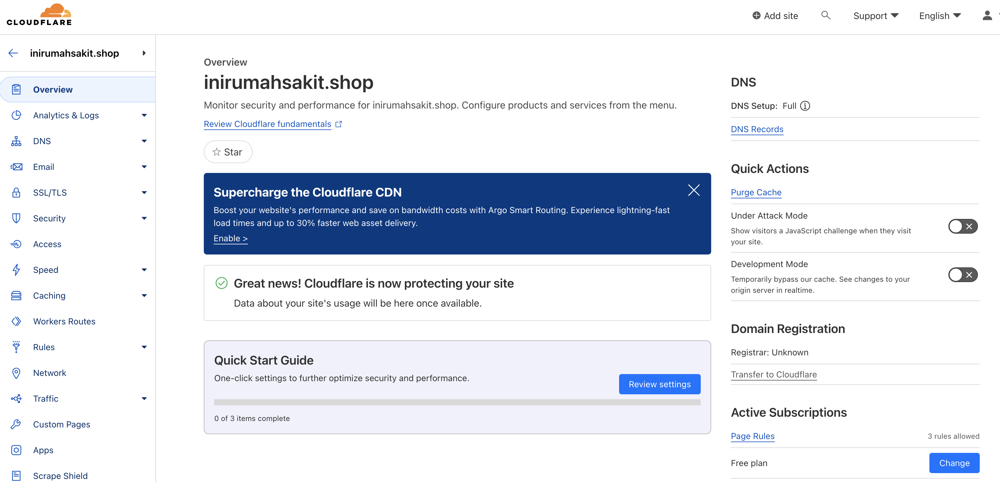

# Documentation Milestone 1 Dimas Adhi Pratama

 

## **1. Deploy Github Project to Netlify** [Click Here](#deploy-github-project-to-vercel)

## **2. Langkah Membuat Domain di Hostinger** [Click Here](#langkah-membuat-domain-di-hostinger)

## **3. Connect custom domain and DNS** [Click Here](#connect-custom-domain-and-dns)

 

### Link Deployment : [Netlify](https://dulcet-sable-378cd3.netlify.app/)

### Link Custom Domain : [Hostinger](https://www.inirumahsakit.shop/)

 

# **Deploy Github Project to Netlify**

### 1. Buka netlify.com, Klik **Log In** jika sudah pernah sign up sebelumnya, lalu sambungkan Github dengan Netlify

### 2. Klik **Add New Site** dan pilih **Import an existing project**

### 3. Pilih **Deploy with Github**

### 4. Pilih Repo yang ada di Github dan pilih project yang akan dideploy

### 5. Scroll ke bawah dan klik **Deploy**

    

# **Langkah membuat Domain di Hostinger**

### 1. Buka website hostinger.co.id dan Klik **Log In**. Jika sudah berhasil Log In maka pilih Tab **Domains** dan pilih **Get a New Domain**

### 2. Jika sudah memasukkan nama domain yang diinginkan, maka dilanjutkan untuk memilih nama akhir domain, contoh pilih .shop dan klik search. Jika nama domain tersedia maka klik **Buy Now**

### 3. Dilanjutkan untuk pemilihan paket pembayaran. Klik **Choose Payment Method**

### 4. Pilih jenis pembayaran, sebagai contoh kita akan memilih pembayaran melalui QRIS.

### 5. Jika sudah berhasil melakukan pembayaran maka klik continue dan selanjutnya hubungkan domain dengan DNS menggunakan cloudflare

    

# **Connect custom domain and DNS**

### 1. Buka website **cloudflare.com** lalu pilih **sign up** atau **log in** dengan mengisi email dan password

### 2. Jika sudah berhasil **sign up** maka pilih **Add Site** button

### 3. Isi nama domain yang sudah dibuat pada kolom yang tersedia dan klik **Continue**

### 4. Akan tampil pilihan paket lalu scroll ke bawah dan pilih \*Free** lalu klik **Continue\*\*

### 5. Jika sudah tampil halaman berikut maka scroll ke bawah dan klik **Continue**

### 6. Selanjutnya Klik **Continue** di bagian bawah dan copy 2 **Name server** ke website hostinger

### 7. Buka kembali webiste Hostinger dan pilih **DNS/Nameservers** di sidebar kiri lalu klik **Change Nameservers**

### 8. Pada menu **Select Nameservers** pilih **Change Nameservers**, lalu paste 2 **Nameservers** dari **Cloudflare** lalu klik **Save**

### 9. Akan muncul **Pop Up** seperti halaman berikut dan klik **Close**, tunggu kurang lebih 24 jam agar website sudah dapat dipublish

### 10. Jika sudah 24 jam maka cek kembali ke halaman **Cloudflare** klik menu Overview di sidebar kanan dan jika berhasil akan seperti tampilan berikut

### 11. Jika domain sudah aktif maka kembali buka Netlify dan klik **Set up custom domain** pada nomer 2

### 12. Pada kolom yang tersedia isi custom domain yang sudah berhasil dibuat lalu klik Verify

### 13. Masuk ke halaman cloudflare dan klik **DNS** pada sidebar kiri dan klik edit pada kolom CNAME, paste CNAME dari Netlify, scroll ke bawah dan klik Save

### 14. Masuk kembali ke Netlify dan refresh page, jika sudah tampil seperti halaman berikut berarti sudah berhasil. CONGRATS!!!

